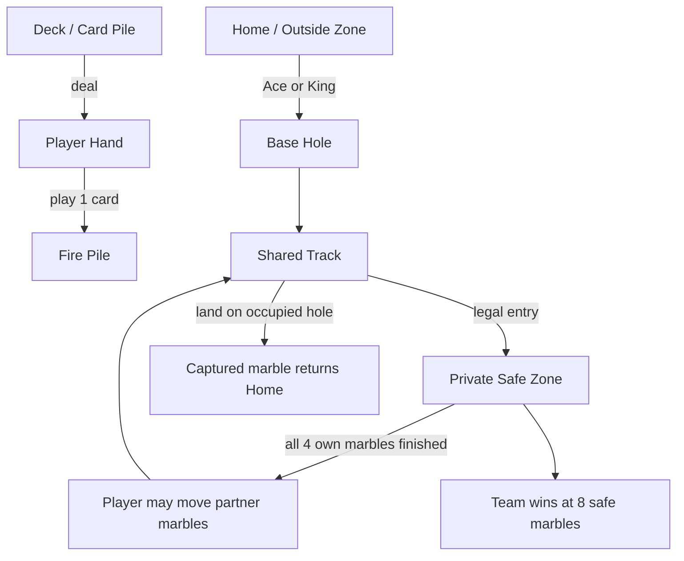
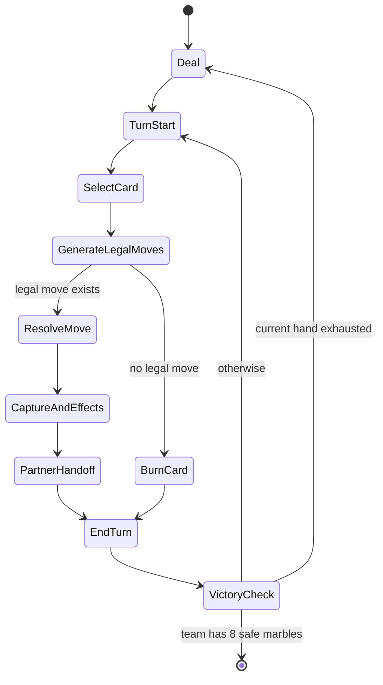

# Jackaroo Verified Rules Audit and Offline Implementation Guide

## Executive summary

Jackaroo does **not** have one universally fixed public English ruleset. The clearest official English baseline is Jawaker’s **Jackaroo** rules page, while Jawaker’s **Jackaroo Complex** page, CatsAtCards’ comparative digest, and Jackaroo World–adjacent retailer/custom guides document meaningful rule drift in deal cycles, turn order, movement restrictions, and card powers. JackaroKW also explicitly says each set includes an instruction sheet so players agree on the rules and that players can make their own rules, which is strong evidence that house-rule variation is normal. citeturn4view3turn4view4turn18view0turn13view0turn6search5

For an offline game, the safest developer choice is to ship a **default canonical preset** based on **Jawaker Basic** and treat disputed mechanics as toggles. That default should be: 4 players, opposite-seat partnerships, 4 marbles each, 52-card deck, dealer chosen randomly, 4 cards dealt to each player, first turn to dealer’s left, clockwise play, Ace field-or-1-or-11, King field only, Jack swap, 7 split between two own marbles, 4 backward, and all other cards by face value. Protected Base cells and the “two consecutive marbles create a temporary base/blockade” rule are official in Jawaker’s rules. citeturn4view3turn27search0

The prior Gemini audit fileciteturn0file0 is **partly right** about the need for a strict legal-move generator and about the importance of the blockade rule, but its strongest claim — that **4-4-5 is mathematically required and therefore “basic” Jackaroo** — is **incorrect**. Jawaker’s official English rules document **4-card deals** and reshuffling the Fire Pile after cards are exhausted, but they do **not** establish a 4-4-5 deal cycle. CatsAtCards documents a different **4-then-5** community pattern, and a Bader/Jackaroo World–adjacent custom guide presents **4-4-5** while openly stating its group has customized rules. In other words: **4-4-5 is a variant, not a verified universal rule.** citeturn4view3turn18view0turn13view0

## Verified canonical rules

Use the following as the **shipping default ruleset** for offline hot-seat and human-vs-computer play. It is the closest thing to a verified canonical baseline in the public English sources, because it tracks Jawaker’s official rules and only fills gaps where Jawaker is silent or translation-ambiguous. citeturn4view3turn27search0

The default table setup is **4 players in two teams**, with partners sitting opposite each other. Each player has **4 marbles** in Home and the team wins by getting **all 8 team marbles** into the Safe zones. Jawaker’s Complex page also confirms the board model: Home, Base, Safe Zone, shared Path/Track, Fire Pile, and Deck. citeturn4view3turn4view4

At the start of a round, choose a dealer randomly. The dealer deals **4 cards to each player**; the player to the dealer’s **left** starts; play proceeds **clockwise**. Jawaker Basic says the Fire Pile is shuffled back into the Card Pile after cards are used/exhausted and does not document a 4-4-5 cycle. Treat the precise hand/dealer-cycle edge cases as preset details if you need to match a specific table. citeturn4view3turn27search0

### Default card effects

| Card | Default offline effect | Notes |
|---|---|---|
| Ace | Field one own marble from Home to Base **or** move one own marble forward **1** or **11**. citeturn4view3 | Official Jawaker Basic. |
| 2, 3, 5, 6, 8, 9, 10 | Move one marble forward by face value. citeturn4view3 | Keep 10 as simple movement in default mode; attack variants belong in presets. |
| 4 | Move one marble **backward 4**. citeturn4view3 | Reverse movement matters for routing and shortcut tactics. |
| 7 | Split **7 total steps across two of your own marbles**. citeturn4view3 | Do **not** hard-code broader split semantics into the default preset. |
| Jack | Swap **one of your marbles** with **an opponent’s marble**, with neither in Home, Base, or Safe. Jawaker Complex states this clearly; Basic is consistent but more loosely worded. citeturn4view4turn4view3 | Treat opponent-only targeting as the verified default. |
| Queen | Move one marble forward **12**. Jawaker Basic says “other cards” move by face value; Queen is therefore 12 in the default preset. citeturn4view3 | Suit-specific Queen powers are variant rules, not Jawaker Basic. |
| King | Field one own marble from Home to Base. citeturn4view3 | The 13-step capture King belongs in Complex/community presets only. |

### Required movement and collision rules

If a marble **lands on another marble**, the marble that was landed on is returned to Home. A marble on its **own Base** cannot be bypassed, captured, or swapped. Jawaker also explicitly defines the **blockade** rule: if two marbles are consecutive, the **front marble is treated as a temporary Base** and cannot be bypassed, captured, or swapped. citeturn4view3turn29search0

For a production engine, I recommend enabling **`cannot_pass_own_marble = true`** in the default preset, because Jawaker Complex says “a player cannot pass themselves,” CatsAtCards also prohibits passing one of your own marbles, and Jawaker Basic appears to support the same idea in Arabic/third-party English summaries. Because Jawaker’s official English Basic wording is translation-ambiguous, this is a **verified-but-consolidated default**, not a clean direct English Basic quote. citeturn29search0turn18view0

Safe-zone entry is **source-ambiguous**. Jawaker says the card value must permit entry into the Safe Zone “preventing” another lap; Bader’s custom Jackaroo World–adjacent guide says extra steps beyond what is needed do **not** allow entry; CatsAtCards says the full card value must be used and, in its digest, overflow can continue around the main track rather than fizzle. For implementation, use an **ordered 4-cell Safe lane**, require **full-card consumption**, forbid jumping inside Safe, and make the exact-entry behavior a preset toggle if you need to match a specific household. citeturn4view3turn13view0turn18view0

When a player gets **all 4 of their marbles** into Safe, they continue taking turns but may now move their **partner’s marbles**. That teammate-handoff rule is documented in Bader’s custom Jackaroo World–adjacent guide, CatsAtCards, and other public digests, and should be part of your default engine. citeturn13view0turn18view0

## Variant comparison

This table’s final column refers to Bader’s custom Jackaroo World–adjacent guide, not the official Jackaroo World PDF/manual; the official PDF differs on at least first-player direction.

| Topic | Jawaker Basic | Jawaker Complex | CatsAtCards Jackaroo digest | Bader custom guide |
|---|---|---|---|---|
| Deal cycle | Documents **4-card** deals and Fire Pile reshuffle after cards are exhausted; no 4-4-5 cycle is stated. citeturn4view3 | Same documented 4-card/no-4-4-5 baseline. citeturn4view4 | Deal **4** first, then **5-card** hands repeatedly; reshuffle when deck exhausts. citeturn18view0 | **4-4-5**; author explicitly says the group has customized rules. citeturn13view0 |
| First player / table direction | Dealer’s **left** starts; play **clockwise**. citeturn4view3 | Same. citeturn4view4 | Dealer’s **right** starts; table play **counter-clockwise**, while marble travel is clockwise. citeturn18view0 | Dealer’s **left** starts; play **clockwise**. citeturn13view0 |
| King | Field only. citeturn4view3 | Field **or** move **13**, capturing passed marbles. citeturn4view4 | Field **or** move **13**, capturing passed marbles. citeturn18view0 | Field **or** **13** with capture. citeturn13view0 |
| Five | Simple **+5 forward**. citeturn4view3 | Move **any marble** on track +5. citeturn4view4 | Move **any marble** +5, with extra restrictions around Base/Goal. citeturn18view0 | Move **any marble in play** +5, except Base-hole marbles. citeturn13view0 |
| Seven | Split across **two own marbles**. citeturn4view3 | “Split into two steps”; still effectively two-marble semantics. citeturn4view4 | May be divided across **two or more** own marbles. citeturn18view0 | Split into **two own marbles**. citeturn13view0 |
| Jack | Swap rule only. citeturn4view3 | Swap **your marble** with **opponent marble**. citeturn4view4 | **Black Jack** swaps; **Red Jack** moves 11. citeturn18view0 | Swap a marble not in Base with another color marble. citeturn13view0 |
| Queen | Face value **12**. citeturn4view3 | Face value **12**. citeturn4view4 | **Black Queen** = 12; **Red Queen** = discard/skip attack. citeturn18view0 | **Black Queen** = 12; **Red Queen** = discard attack. citeturn13view0 |

## Fact-check of the Gemini audit

The prior Gemini audit fileciteturn0file0 is useful on engine rigor, but several of its conclusions are too absolute.

| Gemini-audit claim | Verdict | Evidence |
|---|---|---|
| **“4-4-5 is not a variant; it is basic math.”** | **Incorrect.** Jawaker’s official English rules document **4-card** deals and reshuffling after cards are exhausted, but do not establish 4-4-5. CatsAtCards documents a different **4 then 5** cycle, and Bader’s custom guide presents **4-4-5** while explicitly calling its guide customized. citeturn4view3turn18view0turn13view0 |
| **Blockade rule is a core omitted mechanic.** | **Supported.** Jawaker Basic and Complex both define the “two consecutive marbles, front one becomes Base” rule. citeturn4view3turn29search0 |
| **You cannot jump your own marbles anywhere on the track under any circumstances.** | **Partly supported, but overstated as universal.** Jawaker Complex explicitly says a player cannot pass themselves, CatsAtCards agrees, and Jawaker Basic appears to support this in Arabic/third-party English summaries; the official English Basic text is translation-ambiguous. Use it as a default toggle, not as a proof-text universal. citeturn29search0turn18view0 |
| **Jack must target an opponent marble.** | **Supported for the default preset.** Jawaker Complex is explicit, and Jawaker Basic’s wording is consistent with an opponent-target swap. citeturn4view4turn4view3 |
| **The “4 backward to Safe” shortcut is a standard topology fact.** | **Plausible/common, but not fully canonical.** Bader and CatsAtCards both describe the reverse-shortcut idea, but Jawaker’s official English pages do not publish a full topology diagram proving one fixed geometry for all boards. citeturn13view0turn18view0 |

## Open-source landscape

Public Jackaroo code exists, but the reusable ecosystem is still thin and skewed toward **student/custom adaptations** rather than a confidently rules-faithful, production-ready engine. citeturn2view0turn30view0turn19view4

| Repository | What it is | Maturity signals | License status | Safe to reuse directly |
|---|---|---|---|---|
| `aalhendi/jackaroo-py` | Python **engine/simulation** repo; closest public engine-first implementation. citeturn2view0turn21view6 | 41 commits; `tests/` folder visible; rules encoded in README; Poetry/dev tooling present. citeturn4view2turn20view0 | `pyproject.toml` declares **MIT**, but I did **not** retrieve a standalone LICENSE file from the repo page. citeturn20view0 | **Reference first; copy only after LICENSE file verification.** |
| `YassinSabek2k05/Jackaroo-Team-28` | Java/JavaFX **single-player custom adaptation** with 1 human vs 3 CPU. citeturn30view0 | 230 commits; `src/`, `bin/`, JavaFX UI, MVC README. No visible tests folder or LICENSE on page. citeturn30view0 | **No visible license surfaced** in the web output. citeturn3view0turn30view0 | **No** for direct copying until explicit license is confirmed. |
| `youssef4laa/Jackaroo` | Java **single-player custom spin** with 3 CPU, 15 card types, 100-cell board, trap cells. citeturn21view0turn21view1 | 179 commits; `src/`, public milestone test file, releases, structured README; the current root listing does not show a standalone `test/` folder even though the README project tree lists one. citeturn19view4turn19view6 | README says **MIT License** and points to `LICENSE`, but the LICENSE file itself was not retrievable in web output. citeturn19view3 | **Conditionally** reusable; verify the actual LICENSE file before copying code. |

## Developer recommendations

Model the board as a **graph of typed nodes**, not as `position += n`. Reverse moves, protected Base cells, two-marble blockades, swaps, and Safe entry are all **path-dependent**, not just destination-dependent. The engine should generate **legal actions** from `(card, controlled marble, path partition)` and simulate the path step-by-step. That is especially important for **7** splits, **Jack** swaps, **4** reverse moves, and optional presets like **5-any-marble** or **King-13-capture**. citeturn4view3turn4view4turn18view0

Use a **preset/toggle schema** rather than one giant rule enum. At minimum: `deal_cycle`, `seat_order`, `king_mode`, `five_mode`, `seven_mode`, `jack_mode`, `queen_mode`, `cannot_pass_own`, `burn_on_no_move`, and `safe_entry_mode`. This is the only practical way to reconcile Jawaker Basic, Jawaker Complex, CatsAtCards, and Jackaroo World–style custom rules without rewriting the engine. citeturn4view3turn4view4turn18view0turn13view0

For AI, treat the game as **imperfect information** because opponents’ hands are hidden and some variants include discard attacks. A solid MVP is: deterministic seedable shuffle; local move generation; heuristic evaluation using progress-to-safe, unblock potential, capture threat, partner assistance, and hand flexibility; and a clean ownership rule that switches legal targets to the partner only after the current player has finished all 4 own marbles. That handoff rule is critical. citeturn13view0turn18view0

For hot-seat privacy, add a **pass-the-device interstitial**, optional **tap-to-reveal hand**, short **privacy mask timeout**, and an optional “**confirm card**” step before action selection. For debugging and reproducibility, keep **deterministic shuffles**, full move logs, and replayable seeds.

The best MVP presets are: **Jawaker Basic** as default; **Jawaker Complex** as an official advanced mode; and **Community/CatsAtCards** as an opt-in preset for players expecting 13-King, 5-any-marble, red/black court-card behavior, or 4→5 deal cycles. citeturn4view3turn4view4turn18view0

## Assumptions and reuse checklist

The main assumptions you will still need to lock down are these:

- **Burn/discard on no legal move** is recommended, but Jawaker Basic does not explicitly state it; this comes from comparative/community sources. citeturn13view0turn18view0
- **No passing your own marbles** is explicit in Jawaker Complex and supported by CatsAtCards; Jawaker Basic appears to support it in Arabic/third-party English summaries, but the official English Basic wording is translation-ambiguous. I recommend enabling it by default. citeturn29search0turn18view0
- **Safe-zone internal occupancy** is not fully specified in Jawaker’s official English text; I recommend an ordered 4-cell safe lane with no jumping. citeturn4view3turn13view0
- **Bader/custom-guide 4-4-5** should be treated as a **custom/community preset**, not as the universal base game, because the cited guide itself says the group customized its rules. Do not conflate that guide with the official Jackaroo World PDF/manual. citeturn13view0

Before copying any open-source code, verify reuse rights with this short checklist:

- Confirm there is an actual **LICENSE file in the repository root**, not just a README or package metadata claim. citeturn20view0turn19view3
- Check whether the license covers **source code, assets, audio, and images**, not just code.
- Record the exact **commit hash** you reviewed and keep the license text with your vendor notes.
- If the repo is a **student/custom adaptation**, assume rules and assets may diverge from standard Jackaroo even if the code is legally reusable. citeturn30view0turn21view0

Publication note: the `cite...` and `filecite...` markers are Deep Research/internal citation IDs. Replace them with ordinary links or footnotes before sharing this report outside the original research session.

Readable source links:

- Jawaker Basic English: https://blog.jawaker.com/en/jackaroo-rules-en/
- Jawaker Basic Arabic: https://blog.jawaker.com/jackaroo-rules/
- Jawaker Complex English: https://blog.jawaker.com/en/jackaroo-complex-rules-en/
- CatsAtCards Jackaroo section: https://www.catsatcards.com/Games/PegsAndJokers.html
- Bader custom Jackaroo World-adjacent guide: https://baderalrowaiei.com/blog/jackaroo-world-board-game-how-to-play/
- Official Jackaroo World PDF/manual: https://www.jackarooworld.com/pdfs/Jackaroo-World-Manual.pdf
- JackaroKW product/instruction note: https://jackarokw.com/en/product/jackaro-two-players/
- `aalhendi/jackaroo-py`: https://github.com/aalhendi/jackaroo-py
- `YassinSabek2k05/Jackaroo-Team-28`: https://github.com/YassinSabek2k05/Jackaroo-Team-28
- `youssef4laa/Jackaroo`: https://github.com/youssef4laa/Jackaroo
